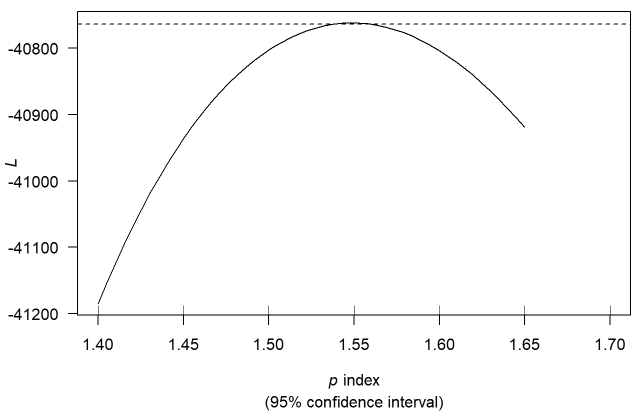
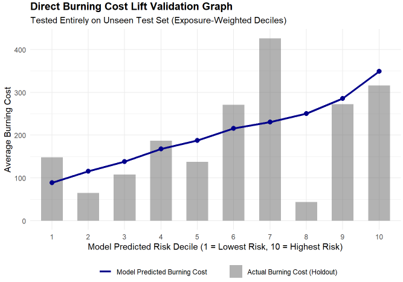
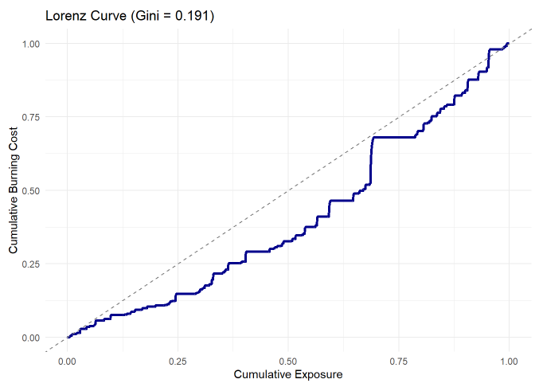
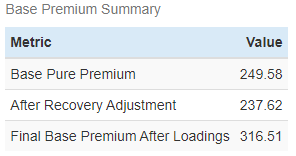
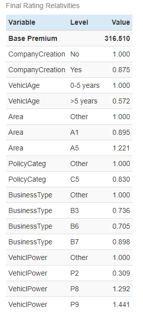

# Motor Insurance Pricing using Tweedie GLMs

## Overview

This project develops a motor TPL pricing model using real insurer data from the Actuarial Pricing Game organised by the French Institute of Actuaries.

The primary focus is not the GLM itself, but the actuarial judgement required to address real-world data limitations. The project documents the assumptions, preprocessing decisions, and modelling choices used to transform raw insurance data into a pricing-ready dataset and derive final rating relativities using a Tweedie GLM.

This README provides a high-level overview of the project. For a more comprehensive walkthrough of the data preparation process, actuarial assumptions, preprocessing decisions, modelling methodology, validation results, and selected code snippets, see the full R Markdown report [here](https://S7aru.github.io/Motor-TPL-GLM-Pricing-Model/report/index.html). 

The complete project source code can be accessed [here](code/Motor-TPL-Pricing-Project.Rmd).

## Dataset

The dataset consists of two components:

### Policy Data

The policy dataset contains three years of policy-level information, including policy and vehicle identifiers, underwriting variables used as potential rating factors, and policy inception and expiry dates used for exposure calculations.

### Claims Data

The claims dataset contains the corresponding policy and vehicle identifiers, claim transaction amounts, and the calendar year in which each transaction was recorded.

## Data Limitations

Several practical challenges were identified during the analysis:

- Original policy identifiers were not always unique due to mid-term endorsements.
- The dataset was aggregated on a calendar-year basis, requiring assumptions to approximate a policy-year pricing framework.
- Accident and payment dates were unavailable, limiting traditional reserving and trending analyses.
- Claims were recorded as transactions rather than individual claims, with no unique claim identifiers available, preventing reliable frequency modelling.
- Negative claim amounts were present due to recoveries (e.g., salvage and subrogation).
- Several rating factor levels contained limited exposure, requiring consolidation prior to modelling.

These limitations required a series of actuarial assumptions and preprocessing decisions before a pricing model could be developed.

## Data Preparation & Assumptions

Several preprocessing steps and actuarial assumptions were required before modelling:

- Policy exposure was calculated from policy inception and expiry dates as.
- A new unique identifier was constructed to address non-unique policy records caused by mid-term endorsements.
- Claim amounts were assumed to represent ultimate losses due to the absence of accident and payment dates.
- Traditional actuarial loss trending was not possible due to the absence of accident dates and payment histories. Instead, a flat annual trend rate was estimated from historical burning costs and applied to adjust claims to a common cost level.
- Negative claim amounts, primarily arising from salvage and subrogation recoveries, were floored at zero for modelling purposes. The overall impact of recoveries was then captured separately through a portfolio-level recovery adjustment.
- Claims were aggregated to the policy level and converted into burning costs, which served as the modelling target variable.

## Feature Engineering

Before model development, all candidate rating variables were converted to categorical factors and reviewed for credibility.

- Rating factor levels with limited exposure were consolidated to improve statistical stability.
- Variables containing predominantly sparse levels were excluded from the analysis where appropriate.
- Baseline levels were selected based on the category with the largest exposure, allowing all model relativities to be interpreted against the most credible segment.
- The final modelling dataset was partitioned into training and testing subsets using an 80/20 split to facilitate out-of-sample validation.

## Modelling Approach

As discussed in the data limitations section, a traditional frequency-severity framework was not feasible because claims were recorded as transactions and no unique claim identifiers were available. Burning cost was therefore modelled directly at the policy level.

A Tweedie Generalized Linear Model (GLM) was selected due to its suitability for insurance pricing data, where a large proportion of policies have zero losses while positive losses are continuous and highly skewed.

The Tweedie variance power parameter was calibrated empirically by fitting a range of candidate models and selecting the value that produced the best overall fit.

## Tweedie Variance Power Selection

The optimal variance power parameter was found to be approximately 1.55 and was subsequently used in the final model.

*Figure 1: Profile likelihood used to identify the optimal Tweedie variance power parameter.*

## Model Validation

The final model was validated using an unseen 20% test data based on multiple approaches, which are:

### Statistical Significance

Model coefficients were reviewed using standard GLM significance tests alongside exposure credibility and actuarial judgement. Variables and levels that were not statistically significant, lacked sufficient exposure, or were considered unsuitable rating factors were removed or consolidated.

### Actual-to-Expected (A/E) Analysis

Portfolio calibration was assessed by comparing actual and predicted burning costs on the holdout dataset.

The model achieved an A/E ratio of approximately 0.97, indicating that actual burning costs were only slightly lower than predicted. This relatively small difference suggests that the model is reasonably well calibrated at the portfolio level.

### Lift Analysis

Exposure-weighted lift charts were used to assess the model's ability to rank risks from lowest to highest expected loss cost.

The predicted burning costs generally increased across risk deciles, suggesting that the model is able to distinguish between lower- and higher-risk policyholders. Observed burning costs followed a broadly similar pattern, although some fluctuations were present due to claim volatility.

### Gini Index & Lorenz Curve

The discriminatory power of the rating plan was assessed using the Gini Index and Lorenz Curve.

The model achieved a Gini Index of approximately 19%, suggesting a moderate-to-low level of risk segmentation. While some separation between lower- and higher-risk policyholders is evident, the results indicate that additional predictors could further improve the model's discriminatory power.

## Final Rating Plan

### Recovery Adjustment

Negative claim transactions arising from salvage and subrogation recoveries were removed during modelling by flooring policy-level losses at zero. The overall impact of recoveries was then reintroduced through a portfolio-level recovery adjustment.

### Pricing Loadings

Pure premiums were adjusted for recoveries and subsequently loaded for expenses, commissions, profit, contingency, and other business requirements. The loading assumptions were sourced from the IA pricing review report and applied to derive final indicated premiums.

| Pricing Loading | Rate |
|----------------|------|
| Expense Loading | 17.1% |
| Commission Loading | 11.7% |
| Contingency Loading | 2.2% |
| Profit Loading | 2.0% |
| Other Loading | 0.2% |
| **Total Pricing Loading** | **33.2%** |

### Base Premium

The model intercept was converted into a base premium and adjusted for recoveries and pricing loadings.

### Rating Relativities

Final rating relativities were obtained by exponentiating the fitted GLM coefficients. Each relativity represents a multiplicative adjustment relative to the baseline level of the corresponding rating factor.

Retained rating factors include:

- Company Creation Status
- Vehicle Age
- Geographic Area
- Policy Category
- Business Type
- Vehicle Power

